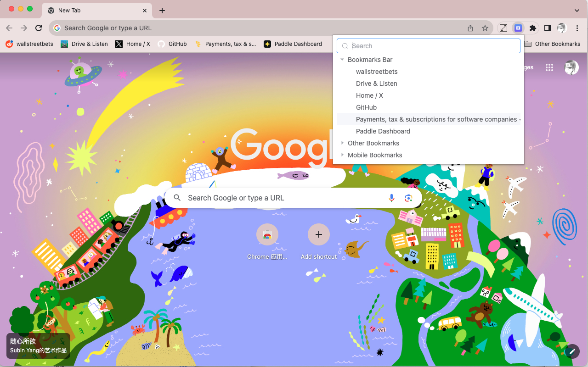

---
# https://vitepress.dev/reference/default-theme-home-page
layout: home

hero:
  name: "Super Bookmarks"
  text: "Open your bookmarks conveniently and quickly"
  tagline: You only need to press the shortcut key (Ctrl+B on Windows, Command+E on Mac) to quickly open this extension and open bookmarks. At the same time, Super Bookmarks also supports search function, which can quickly find the bookmarks you need to open.
  image: /icon.png
  actions:
    - theme: brand
      text: Add to Chrome
      link: https://chrome.google.com/webstore/detail/ig-auto-follow/iiaohnpoogjkomcdkhdfljgpglejpaad?hl=zh-CN&authuser=0

features:
  - title: Feature One
    details: Command + E(Mac)、Ctrl+B(Windows) to quickly access bookmarks.
  - title: Feature Two
    details: Enter keywords directly to search.
  - title: Feature Three
    details: More features(manage bookmarks, edit bookmarks, drag and drop bookmarks) are coming soon.
---

<Pricing />